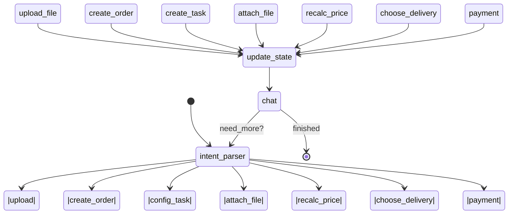

# План изменения графа LangGraph для поддержки текстового оформления заказов (Click‑Knock)

## 1. Общее описание бизнес‑процесса

Новый **Text‑Ordering Bot** должен взять на себя работу веб‑фронтенда Click‑Knock.  
Клиент внутри чата формулирует заказ, прикрепляет макет.  
Далее бот выполняет цепочку REST‑вызовов к Click‑Knock API, дожидается цены и отвечает клиенту.  
Уровень интеграции с CRM/1С остаётся неизменным — он начинается **после** оплаты, поэтому в графе отражаются только шаги до формирования ссылки на оплату. fileciteturn0file2

| Шаг | REST ендпоинт | Описание |
|-----|--------------|----------|
| 1 | `POST /upload` | Загрузить файл, получить `fileId` |
| 2 | `POST /orders` | Создать «пустой» заказ, получить `orderId` |
| 3 | `POST /order‑tasks` | Создать задачу печати, получить `taskId` |
| 4 | `POST /order‑task‑files` | Привязать файл к задаче |
| 5 | `PUT /order‑tasks/{taskId}` | Обновить параметры, дождаться цены |
| 6 | `GET /delivery‑providers` и др. | Получить варианты доставки |
| 7 | `POST /order‑payments/{orderId}` | Получить платёжную ссылку |

## 2. Mermaid‑схема полноценного FSM



*Цикл повторяется до тех пор, пока `phase != "payment_ready"`, после чего граф завершается*.

## 3. Пошаговый план внедрения

Ниже — минимальные атомарные задачи (✅ — чек‑пойнт, \# — инструкция проверки).

| № | Задача | Файлы / сущности | Чек‑пойнт / тест |
|---|--------|------------------|------------------|
| 0 | Создать ветку `feature/order-bot` | git | ✅ CI проходит |
| 1 | **API‑клиент Click‑Knock** (`app/services/click_knock.py`) | Новый файл | \# `pytest tests/test_ck_client.py` с `respx` моками — 200 OK |
| 2 | **Tool‑функции** (`app/core/langgraph/knock_tools.py`)<br> `upload_file`, `create_order`, …| Новый | \# `pytest tests/test_tools.py` — ответы совпадают с фикстурами |
| 3 | Зарегистрировать инструменты в `app/core/langgraph/tools.py` | существующий | ✅ `pytest tests/test_tool_registry.py` |
| 4 | **Расширить состояние** → `PrintState` | `graph.py` | \# класс содержит `phase`, `order_id` и т.д. |
| 5 | **Узел `intent_parser`** (LLM‑classifier) | `graph.py` | \# юнит‑тест: фраза «загрузи pdf» → `upload` |
| 6 | **Узел `call_tool`** — маршрутизация к нужной tool | `graph.py` | \# mock tool, убедиться что вызывается правильная |
| 7 | **Узел `update_state`** | `graph.py` | \# проверка: после `upload_file` в state появляется `file_id`, `phase="file_uploaded"` |
| 8 | **Узел `chat`** с кастомным system‑prompt | `app/core/prompts.py` | \# openAI mock → корректный ответ пользователю |
| 9 | **Cond‑edges** согласно диаграмме (mermaid) | `graph.py` | \# prop‑based test: цикл до `payment_ready` |
| 10 | **RAG‑интеграция** (`LangConnectRetriever`) | `app/core/langgraph/rag.py` | \# в запросе `how to set bleed?` получаем сниппет из docs |
| 11 | **E2E тест FastAPI** (`tests/test_e2e_order.py`) | tests | \# через `/api/v1/chatbot/chat` сценарий до цены |
| 12 | **Dockerfile обновлён** (install httpx, respx) | Dockerfile | ✅ `docker compose up` healthchecks OK |
| 13 | **Grafana дашборд** — новые метрики `phase_duration_seconds` | observability | \# метрика отображается |
| 14 | Pull‑request → code‑review → merge | GitHub | ✅ PR approved |

## 4. Детализация чек‑пойнтов

### 4.1. Tool‑функции (`upload_file`…)

1. Обертки возвращают **только** JSON из Click‑Knock API.  
2. Все ошибки **translate→`LangGraphToolException`** — так LLM получит пользовательское сообщение.  
3. Лимит таймаута 15 сек, 3 ретрая с экспон.‑бэкоффом.

### Тест  
```bash
pytest -q tests/test_tools.py::test_upload_file_success
```
*Ожидаемый результат*: фикстура `fileId="ABC123"`.

### 4.2. Intent Parser

Prompt‐шаблон:

```text
You are a routing assistant.
Possible intents: upload, create_order, config_task, attach_file,
recalc_price, choose_delivery, payment, chit_chat.
Return ONLY the intent.
```

LLM ограничен `max_tokens=3`, temperature 0.  
Фраза ➜ токен с меткой — передаётся в `call_tool`.

### 4.3. Update → Chat

`update_state` маппит JSON‑ответ инструмента в поля `PrintState`.  
`chat` отвечает пользователю и предлагает следующий шаг.  
При `phase=="payment_ready"` в ответ добавляется платёжная ссылка.

## 5. Инструкция по приемочному тестированию

| ID | Действие клиента | Ожидаемый ответ бота |
|----|------------------|----------------------|
| A1 | «Сколько стоит напечатать визитки, файл _card.pdf_, 100 шт?» + файл | «Файл загружен, заказ **123AA** создан, цена **≈ xxx ₴**. Уточнить доставку?» |
| A2 | «Новая Пошта, курьер» | «Стоимость доставки 60 ₴. К оплате 360 ₴. Перейти к оплате?» |
| A3 | «Да» | Ссылка вида `https://bank.example/pay?order=123AA` |

По каждому шагу в логе Langfuse фиксируется `phase` (метка `orders_bot.phase`).  
Критерий приёмки — полный сценарий ≤ 3 сек по happy‑path.

---

> **Готово!** Следуя шагам 0–14, команда сможет пошагово мигрировать граф агента к полноценному «order‑bot» с проверяемыми результатами на каждом этапе.
